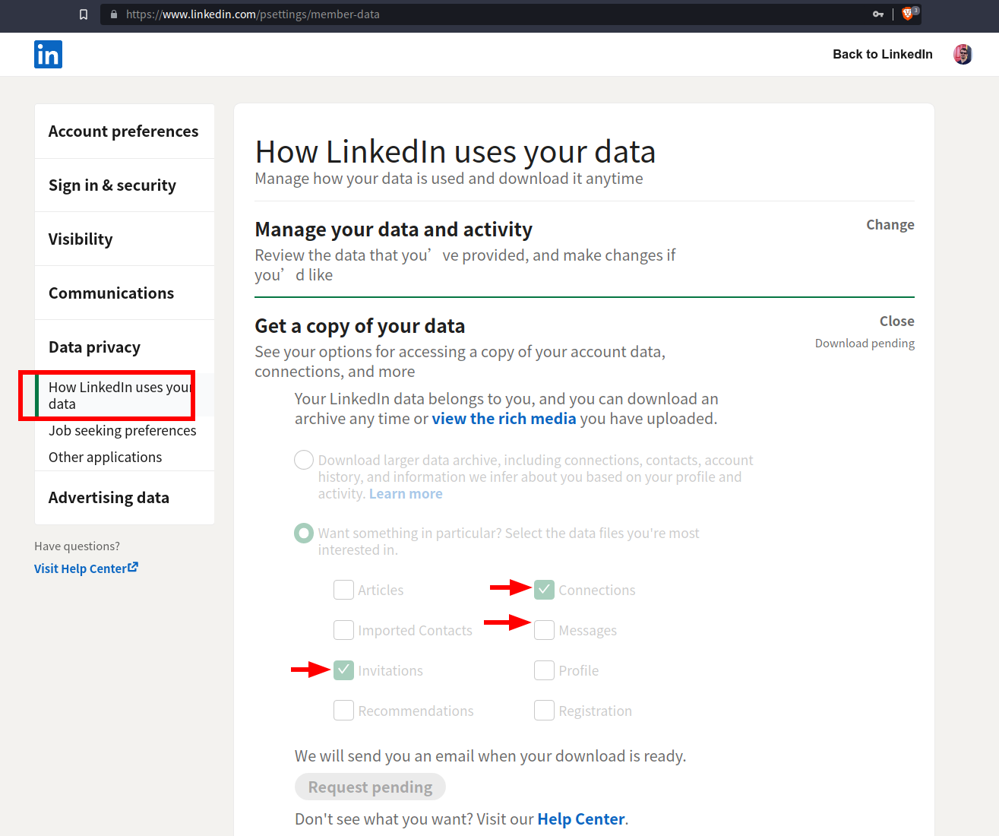

## Linkedin Analyzer

Extracts some stats from your Linkedin activity:
* How many job offers per month
* How many recruiters were added per month
* Most common words in your messages
* Word cloud of the above

### Setting up the necessary input

Request a data export of your Connections, Messages and Invitations from your Linkedin profile:

And put them in `/input`.
